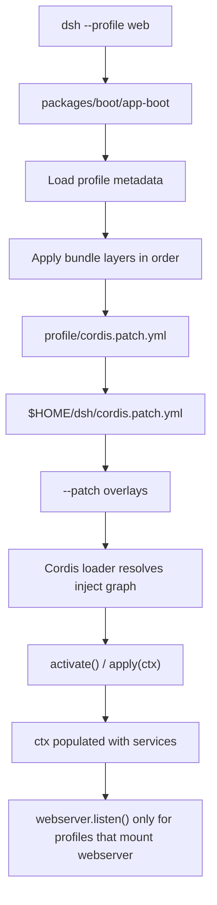
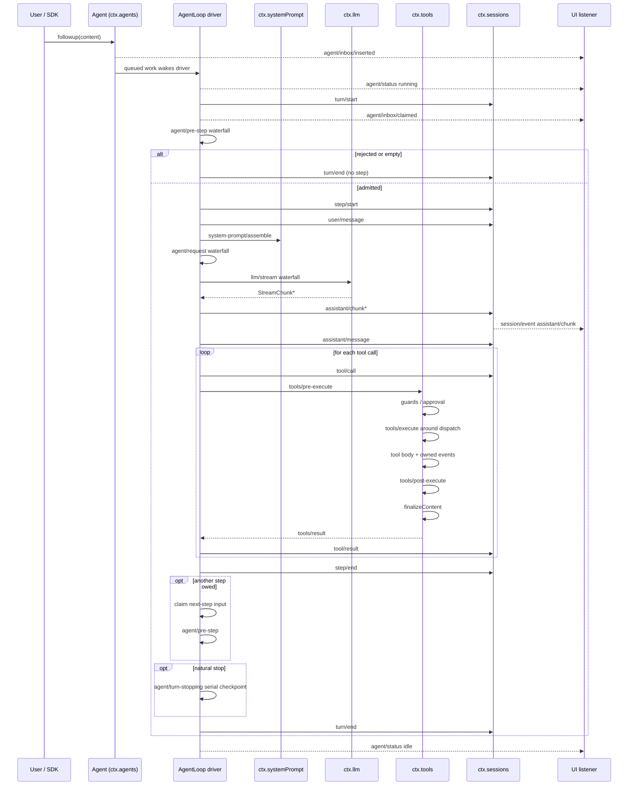
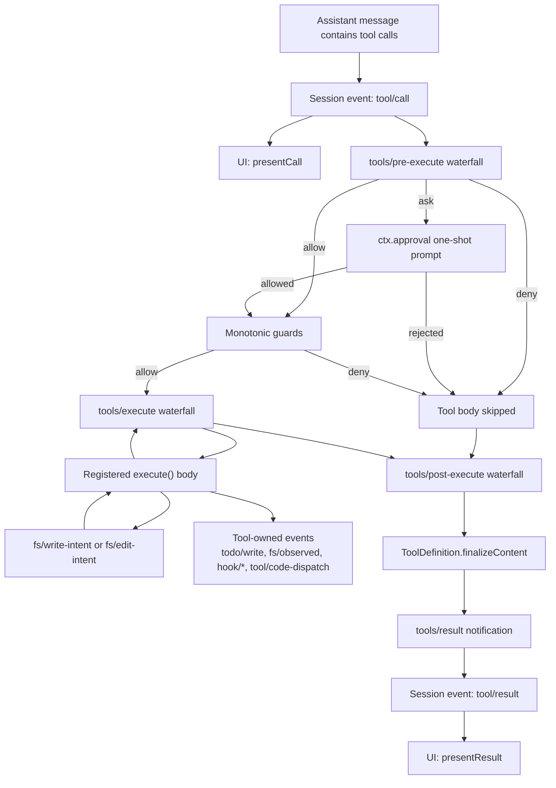
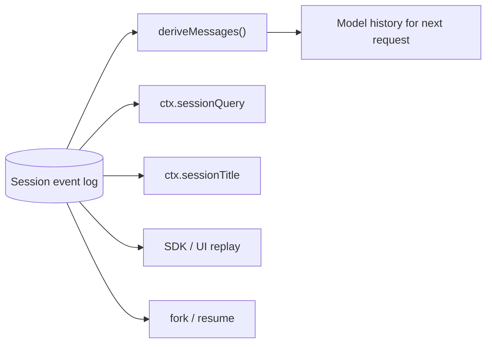
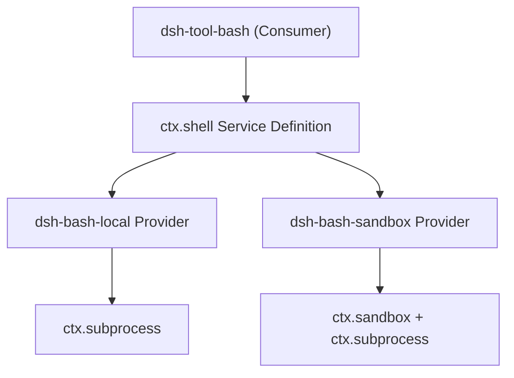
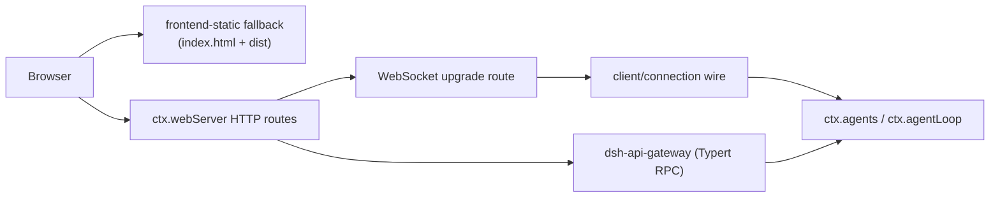
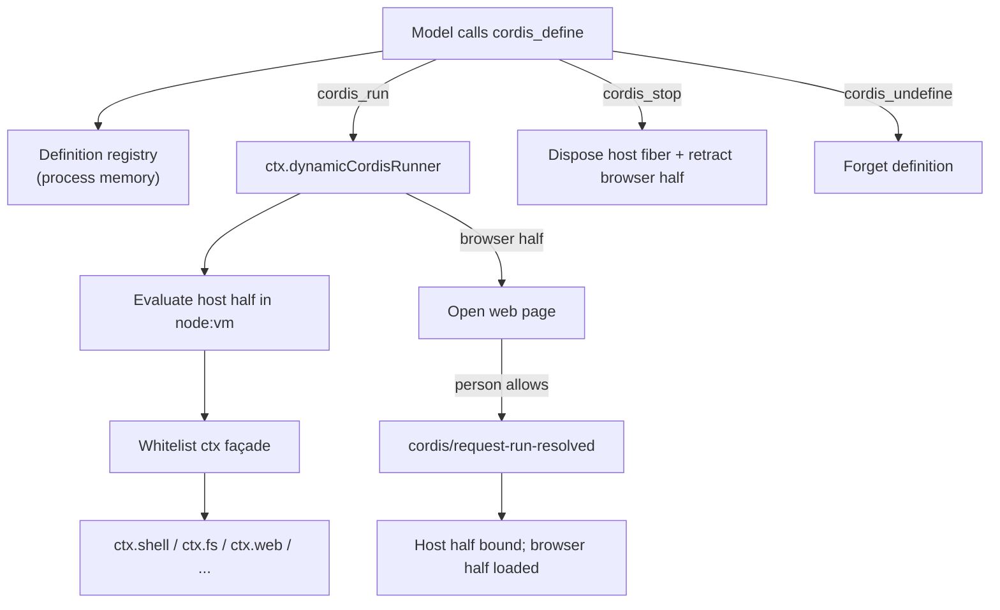
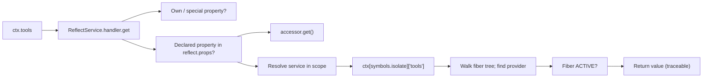
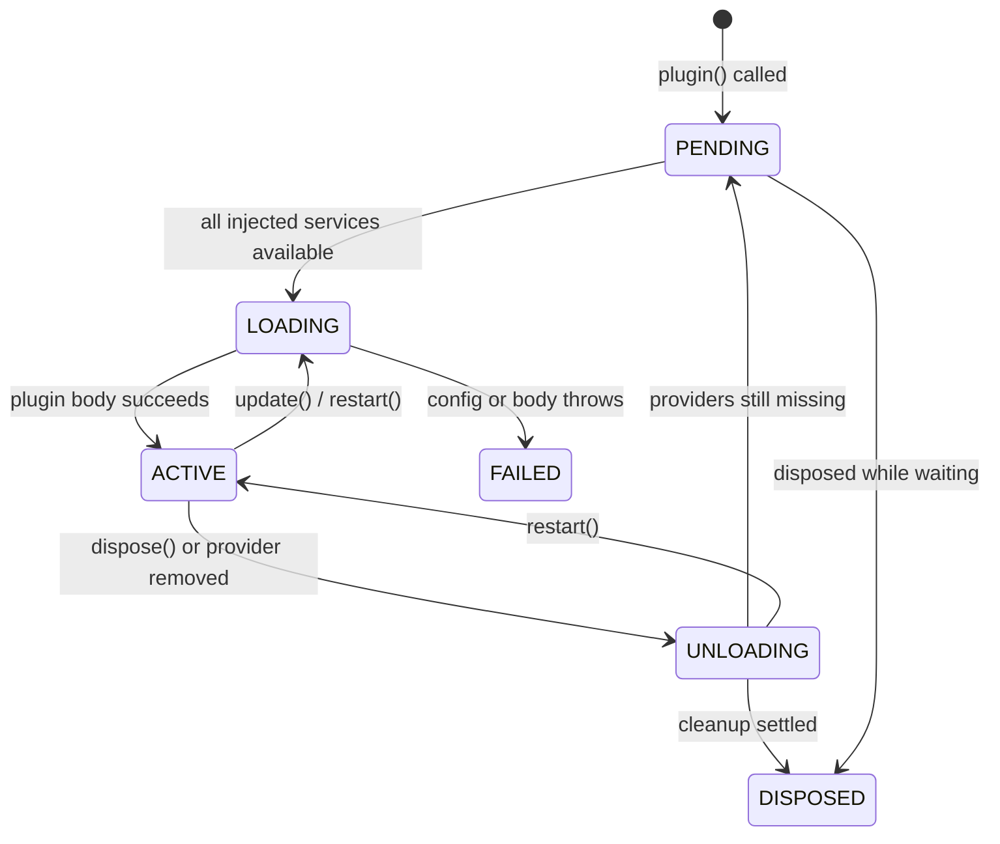

# DeepSeek Harness — Domain Design and Logical Flow

A one-page map of the harness's moving parts for contributors who already know it is a TypeScript/Cordis plugin monorepo.

## 1. Domain map (bounded contexts)

| Domain | Owns | Key `ctx` service | Main packages |
|---|---|---|---|
| **Composition / Boot** | Profile, bundle, patch layers, loader tree, lifecycle | none (Cordis loader) | `packages/boot/app-boot` |
| **Session** | Append-only event log, in-memory projection, fork/resume, titles | `ctx.sessions` | `packages/session`, `packages/session-query` |
| **Agent runtime** | Turn/step driver, inbox, status, prompt assembly | `ctx.agentLoop`, `ctx.agents`, `ctx.systemPrompt` | `packages/core/agent-loop`, `core/agent`, `core/system-prompt`, `core/tools` |
| **LLM capability** | Message vocabulary, streaming adapter seam, providers | `ctx.llm` | `packages/llm/llm` + provider packages |
| **Tools capability** | Tool registry, guarded execution pipeline, tool schemas | `ctx.tools` | `packages/core/tools` |
| **Execution backends** | Bash, PTY, subprocess, sandbox, filesystem, LSP, code runtime | `ctx.shell`, `ctx.terminals`, `ctx.subprocess`, `ctx.sandbox`, `ctx.fs`, `ctx.lsp`, `ctx.codeRuntime` | `packages/shell`, `packages/terminal`, `packages/subprocess`, `packages/sandbox`, `packages/fs`, `packages/lsp`, `packages/code-runtime` |
| **Human collaboration** | Approval, commands, ask-user, feedback, interaction permissions | `ctx.approval`, `ctx.commands`, `ctx.interaction` | `packages/interaction`, `packages/feedback` |
| **Planning and goals** | Same-session goals, plan mode, todo list | `ctx.goals`, `ctx.todo`, `ctx.plan` | `packages/goal`, `packages/plan`, `packages/todo` |
| **Subagent / workflow** | Delegation, Ralph loop, background jobs | `ctx.subagent`, `ctx.workflow`, `ctx.jobs` | `packages/subagent`, `packages/workflow`, `packages/jobs` |
| **Context** | Request context (workspace instructions, time, etc.) | `ctx.context` | `packages/context` |
| **Web host** | HTTP server, route registry, upgrade routes, static fallback | `ctx.webServer` | `packages/host/webserver`, `packages/host/frontend-static` |
| **API / client** | Typert RPC gateway, browser wire, chat UI, conversation nodes | `ctx.apiGateway` (via gateway), client services | `packages/api/*`, `packages/client/*` |
| **Settings / credentials / identity** | User settings, credential records, anonymous identity | `ctx.settings`, `ctx.credentials`, `ctx.identity` | `packages/settings`, `packages/credentials`, `packages/identity` |
| **Self-modification** | Live plugin/service inspection and model-written mount/unmount | `ctx.extensions` | `packages/extensions` |
| **SDK / hooks** | Out-of-process JSON-RPC, Claude Code / Codex wire protocol | `ctx.sdk` | `packages/sdk`, `packages/hooks` |

## 2. Core entities and vocabulary

- **Profile**: a named composition stored in the harness home. It lists bundles and patch files. `web` and `headless` ship as templates.
- **Bundle**: a distribution of Cordis config rows and code that a profile stacks. A bundle can be patched by layers above it.
- **Cordis context**: the runtime container. Plugins expose services on stable `ctx.<key>` keys and communicate through typed events.
- **Capability seam**: a swappable feature with three roles — Service Definition (the `ctx.<key>` and vocabulary), Service Provider (implementation), and Consumer (usually a model-facing tool). One role alone is not a seam.
- **Session**: one conversation stream. The session log is an append-only sequence of `SessionEvent` facts.
- **Turn**: one drain of admitted input. It contains zero or more steps and ends when the model and its tools stop or a policy intervenes.
- **Step**: one model request plus the tool executions it causes.
- **Agent scope**: per-agent registrations (tools, prompt sections, restrictions). Scoped entries shadow same-named global entries for that agent only.
- **Model-visible ⟺ logged**: anything that reaches a model request must be reconstructable from the session log.

## 3. Boot and composition flow



Key points:
- Load order is implied by `inject` declarations, not manual sequencing.
- Every registration is an effect with a disposer; unloading a plugin unwinds its contributions.
- A provider swap (for example, local bash → sandboxed bash) is a composition change, not a code change.

## 4. Agent turn and step lifecycle



Important details:
- `turn/start` and `turn/end` are durable session events.
- `step/start`, `user/message`, `assistant/chunk`, `assistant/message`, `tool/call`, `tool/result`, `step/end` are also durable.
- Live coordination events (`agent/*`, `llm/stream`) are not durable; consume `session/event` for replay.
- `agent/pre-step`, `agent/request`, `llm/stream`, and the `tools/*` events are waterfalls; listeners must call `next()` or they short-circuit the chain.
- `agent/turn-stopping` is a serial terminal checkpoint.

## 5. Tool execution pipeline (zoomed)



Key points:
- `tool/call` is logged before execution so the transcript shows intent even if the call is denied.
- Approval is a first-class capability (`ctx.approval`), not baked into the tool registry.
- Tool-owned events (for example, a todo update) are written by the tool itself during execution.
- `finalizeContent` enforces the tool's synchronous content-only invariant; `tool/result` is the frozen authoritative outcome.

## 6. Session persistence and projection



Invariants:
- The log is append-only and is the source of truth for model-visible state.
- `SESSION_FORMAT_VERSION` only bumps on structural log format changes.
- UI, SDK, and telemetry are projections of the log, not authoritative stores.

## 7. Capability seam swap example



Swapping the provider moves Bash, PTY, and LSP consumers together because filesystem and subprocess providers share one execution world. No consumer code changes.

## 8. Web / API client flow



Notes:
- `dsh-host-webserver` knows no harness concepts; it only provides route registration.
- The API gateway and downlink WebSockets are routes owned by the connection plugin.
- Chat UI nodes are contributed by plugins through `ConversationNodeDefinition` + keyed renderers.

## 9. Extension points map

| What you want to add | Extension point |
|---|---|
| New model provider | Register adapter on `ctx.llm` |
| New model-facing capability | Register tool on `ctx.tools` |
| Per-session capability set | Compose an agent preset with scoped registrations |
| Shell backend | Register `ctx.shell` provider |
| Persistent terminal | Register `ctx.terminals` provider + `dsh-tool-terminal` |
| Human command | Register on `ctx.commands` |
| Background work | Register on `ctx.jobs`; expose `job_*` tools |
| Filesystem policy | Register `ctx.fs` provider or listen to `fs/*` events |
| Process confinement | Register `ctx.sandbox` backend |
| Intercept a tool/turn | Listen to `agent/*` or `tools/*` events |
| Inject model-visible context | Call `agent.inject()`; it lands in the next admitted request |
| New UI chat node | Register `ConversationNodeDefinition` + renderer |
| Durable session state | Extend `SessionEventMap`; render/replay from log |
| Session titles | Register sole `ctx.sessionTitle` provider |
| Same-session objective | Use `ctx.goals` with `agent/*` continuation |
| Fork a session | `ctx.sessions.fork(source, boundary?, childSessionId?)` |
| Scope to one agent | Use that agent's `agent.ctx` |

## 10. Invariants and constraints

1. **Everything is a plugin.** There is no privileged core. Even the agent loop and session log are plugins.
2. **Registrations are effects.** Prompt sections, tools, listeners, and adapters install through `ctx.effect()` / `ctx.on()` and dispose on unload.
3. **Model-visible means logged.** A new model-visible input requires a new `SessionEventMap` entry.
4. **Waterfall listeners delegate.** A listener that does not call `next()` short-circuits the chain.
5. **Scoped shadowing.** Per-agent registrations replace same-named global ones for that agent only.
6. **Capability seams are complete.** A seam needs Service Definition + Provider + Consumer.
7. **Append-only log.** Session events are never mutated after append.
8. **Trust typed boundaries.** Runtime validation is reserved for parser/config, wire, file, worker, and process boundaries, not same-process typed interfaces.

## 11. Self-modification: dynamic Cordis packages

The harness lets the running agent inspect and temporarily extend its own Cordis runtime through the `dsh-tool-cordis` toolset (backed by `ctx.dynamicCordisRunner` in `packages/extensions`). This is an opt-in, development-only capability treated with the same trust as a bash tool: it is not a security boundary and can affect every session in the same process.

### The five model-facing tools

| Tool | What it does |
|---|---|
| `cordis_inspect` | Read-only report over the current process: live services, plugin fibers, registered tools, temporary packages, and generated API/event references. Narrow with `what` and `name`. |
| `cordis_define` | Records a dynamic package (`name`, `purpose`, optional host half `code`, optional browser half `client`) after syntax-checking both halves. Does not run anything. |
| `cordis_run` | Evaluates the host half in a `node:vm` sandbox and, if a browser half exists, asks an open page to load it. Running an already-running package re-delivers the live version. |
| `cordis_stop` | Disposes the host half and retracts the browser half, leaving the definition runnable again. |
| `cordis_undefine` | Stops the package if needed and removes the definition. The card stays in the transcript as a record. |

### Host-only vs dual-half packages

A package can have a **host half** (runs inside the DSH process), a **browser half** (loaded into the web client), or both. Host-only packages affect the runtime immediately. Dual-half packages need a human page to answer the run request because the browser half cannot be forced onto a remote client.



### Sandbox semantics

- Code is evaluated as an async function body in a fresh `node:vm` realm with minimal globals.
- Node built-ins such as `require`, `fetch`, `setTimeout`, and `Buffer` are either absent or redirect to Cordis services, steering mounts onto `ctx.fs`, `ctx.web`, `ctx.bash`, and timer helpers.
- The host half receives a whitelist `ctx` façade that exposes injectable services but hides framework internals; it cannot call `ctx.effect()` directly.
- Service reads require a declared `inject`, preserving Cordis activation and unload semantics.
- `harness.defineTool` / `harness.registerTool` register tools through the host registry so schemas and bodies are normalized and disposable.
- `vmTimeoutMs` bounds only synchronous evaluation; an async body escapes it.

### Composition and lifecycle

- Dynamic packages are mounted under an internal `cordis-dynamic` group fiber.
- Each package gets a process-local id such as `dyn-1`.
- Packages can depend on each other through ordinary Cordis `provide` / `inject`: package A provides `foo`, package B injects `foo` and activates when it exists.
- `cordis_stop` and `cordis_undefine` unwind every owned tool, listener, service, timer, and effect to quiescence.
- Temporary packages disappear on toolset unload or DSH restart.

### API catalog and inspectability

`cordis_inspect` renders from a generated catalog (`src/api-catalog.ts`) that is freshness-gated by `pnpm run verify-cordis-api`. The catalog is produced by the same AST scan as `docs/subsystems/`, so the API the model reads and the published docs cannot drift. Broad reports show summaries; an exact `name` returns full method signatures, JSDoc, and referenced types.

### Storage stance

Definitions live only in process memory. The session log records tool-call metadata, not package source, and nothing is written to disk or restored after restart. To keep an experiment, the model must implement a normal repository plugin or installable bundle through the regular development workflow.

### Trust stance

The sandbox prevents accidental global pollution and guides code toward Cordis services, but a motivated mount can escape through host-realm helpers. A temporary plugin can call `ctx.shell` with the host executor's privileges and reach real filesystems, networks, and other sessions. Load the toolset only where that level of trust is acceptable.

# Cordis deep dive

This section explains Cordis itself — the framework under the harness — because almost every dsh design decision is a direct consequence of how Cordis works.

## What Cordis is

Cordis is a TypeScript plugin framework for applications that want dependency injection, typed events, scoped services, and lifecycle-managed cleanup from a config-driven tree. It is not a web framework, not an Express replacement, and not just a DI container. It is a runtime for building an entire application out of plugins that register services and effects on a shared `Context`.

The harness vendors Cordis into `vendor/cordis` (rescoped to `@deepseek-ai/cordis`) so it can audit, patch, and pin the framework layer. The upstream packages are `cordis` (core), `@cordisjs/plugin-loader`, `@cordisjs/plugin-include`, `@cordisjs/plugin-group`, `@cordisjs/plugin-hmr`, `@cordisjs/plugin-timer`, and `@cordisjs/plugin-logger-console`. Cordis also depends on `schemastery` for config validation and `cosmokit` for utilities, both vendored alongside it.

## Core abstractions

```mermaid
flowchart TD
    Root["new Context() — root container"] --> Child["ctx.extend(meta) / ctx.isolate(name, label)"]
    Context["Context proxy"] --> Events["ctx.events — event bus"]
    Context --> Reflect["ctx.reflect — service resolution"]
    Context --> Registry["ctx.registry — plugin loading"]
    Context --> Logger["ctx.logger — named loggers"]
    Plugin["Plugin: function | class extends Service | { apply } object"] -->|ctx.plugin(plugin, config)| Fiber
    Fiber -->|effect / on / provide| Context
    Service -->|super(ctx, 'name')| Reflect
```

### Context

The `Context` is a proxy. A normal property read such as `ctx.tools` goes through the reflection layer and resolves to whatever service is currently provided under that name. A property write such as `ctx.provide('tools', value)` registers an implementation. Child contexts created with `ctx.extend(meta)` inherit from their parent; metadata added by `extend` shadows the parent without mutating it. `ctx.isolate(name, label)` creates a child context where reads and writes of one service name resolve against a separate label, so different branches of the tree can see different implementations of the same service.

### Service

A `Service` is a class plugin that exposes a named API on `ctx`. It calls `super(ctx, 'name')` in its constructor; Cordis then registers the instance under `ctx.<name>` and removes it automatically when the owning fiber disposes. Services are the building blocks of capability seams in dsh — `ctx.llm`, `ctx.tools`, `ctx.sessions`, and so on.

### Fiber

A `Fiber` is one loaded plugin instance. It tracks the plugin's lifecycle state (`PENDING`, `LOADING`, `ACTIVE`, `UNLOADING`), its validated config, the required services that resolved before it activated, and all effects registered during its lifetime. `ctx.fiber` is the current fiber. Calling `fiber.dispose()` unloads the plugin and waits until every cleanup callback has settled.

### Plugin shapes

A plugin can be a function, a class extending `Service`, or an object with an `apply(ctx, config)` method. All three declare metadata: `name`, `Config` (a schemastery validator), `inject` (required services), `provide` (service names it registers), and `intercept` (service config it consumes). This metadata lets Cordis build the activation graph and validate config before running any code.

### Reflect and registry

`ctx.reflect` implements service resolution: `ctx.get(name)`, `ctx.provide(name, impl)`, `ctx.has(name)`, and the `isolate`/`intercept` machinery. `ctx.registry` implements plugin loading: `ctx.plugin()` and `ctx.inject()`. The registry re-runs a plugin whenever one of its injected services changes, which makes provider swaps dynamic rather than static.

## What Cordis does

### Dependency injection as activation order

A plugin declares what it needs with `inject`. Cordis keeps it `PENDING` until every named service is available, then moves it to `LOADING`, calls its body, and finally `ACTIVE`. If a service is removed later, the plugin is unloaded and will re-activate if the service returns. This means the boot order is derived from the dependency graph, not from a hardcoded list in the launcher.

### Lifecycle-managed effects

Every side effect a plugin creates is registered through `ctx.effect()`. The effect body runs immediately and may return a disposer, a promise, an async disposer, or an array of them. Those disposers are collected and run in reverse order when the plugin is unloaded or when the returned disposer is called. Listeners (`ctx.on`), intervals (`ctx.setInterval`), and service registrations are all effect-backed, so unloading a plugin always unwinds everything it contributed. This is the mechanism behind "no privileged core" and safe hot reload.

### Events with dispatch modes

Cordis provides five event dispatch strategies:

| Mode | Waits? | Order | Short-circuit? |
|---|---|---|---|
| `emit` | no | registration order | no |
| `parallel` | yes | concurrently | no |
| `serial` | yes | registration order | first non-null/false/undefined bail |
| `bail` | no | registration order | first non-null/false/undefined bail |
| `waterfall` | no | registration order | `next()` must be called to delegate; not calling it vetoes |

Events are typed through TypeScript declaration merging. A harness plugin adds `declare module '@deepseek-ai/cordis' { interface Events { 'my/event'(payload): void } }` and then dispatches it. This is why dsh can expose so many interception points (`agent/pre-step`, `tools/pre-execute`, etc.) without hardwiring policy into the loop.

### Loader, include, group, and HMR

`@cordisjs/plugin-loader` reads a `cordis.yml` file and turns it into a tree of plugin fibers. `@cordisjs/plugin-include` lets one config file include another and apply patch overlays. `@cordisjs/plugin-group` nests plugins under a named group so bundles can organize their rows. `@cordisjs/plugin-hmr` watches source and config files and refreshes the tree.

Together they let dsh assemble a product from ordered layers: base bundle, web bundle, profile patch, home patch, `--patch` overlay. Changing a patch file or source module can reload only the affected branch of the tree because Cordis knows how to dispose and re-create individual fibers.

## Scopes and isolation

`ctx.extend()` creates a child that inherits services but can carry its own metadata. `ctx.isolate(name, label)` creates a branch where one service name resolves independently. In dsh this is used for per-agent scopes: an agent's `agent.ctx` is an isolated branch where scoped tools and prompt sections shadow global ones for that agent only. Two `isolate()` calls with the same `label` share the same scope, which is how agent presets or multi-tenant configurations are composed.

## Why dsh uses Cordis

| Requirement | How Cordis satisfies it |
|---|---|
| Everything replaceable | Every capability is a plugin mounted through the loader; no builtin core. |
| No leaked state on reload | Effects and fibers dispose cleanly, so HMR and dynamic packages do not leave stale listeners. |
| Configurable product variants | Profiles and bundles are just different `cordis.yml` compositions; the same packages become CLI, web app, headless, or ACP by swapping bundles. |
| Per-agent capability isolation | `ctx.isolate()` gives each agent its own scoped tool/prompt world. |
| Policy without loop changes | Waterfall and serial events let plugins intercept turns, tool calls, and requests at documented extension points. |
| Model-visible ⟺ logged | Session events are emitted as Cordis events; the durable layer appends them and derives history from the same log. |
| Capability seams | Service Definition / Provider / Consumer maps directly onto Cordis services and plugins. |

## Vendoring and local hardening

The harness does not consume Cordis from npm. It keeps a pinned copy in `vendor/` and applies local modifications that are listed in `vendor/README.md`. The most important ones for understanding dsh are:

- **Fiber lifecycle hardening**: closes reentrant disposal gaps, makes cleanup owner-visible until quiescence, and prevents new effects from being created during `UNLOADING`.
- **Loader/Include transactional reconciliation**: a failed config update rolls back to the previous plugin state instead of leaving the tree half-changed.
- **Lazy config resolution**: `!!js` expressions in config are resolved only after injected services are active, so config can depend on runtime state.
- **HMR exact config watching**: watches the real config path and suppresses the initial scan that would otherwise trigger mid-boot refreshes.

# What reflection means in Cordis

In everyday programming, **reflection** means the program can inspect and change its own structure at runtime. In Cordis, "reflection" specifically means the `ReflectService` that powers the `Context` proxy: it turns a plain-looking property access like `ctx.tools` into a runtime lookup through service registrations, scopes, and lifetimes.

## The context is a proxy

`new Context()` does not return a plain object. It returns a `Proxy` whose traps live in `ReflectService.handler`. When code reads `ctx.tools`, the proxy's `get` trap runs instead of a simple field lookup.



This is why `ctx.tools` returns the currently active tool registry, not a value frozen at boot.

## What ReflectService owns

| Internal structure | Purpose |
|---|---|
| `props` | Every declared context property by name, tagged either `service` or `accessor`. |
| `store` | Concrete `Impl` records keyed by isolation symbol. An `Impl` holds the value, the providing fiber, and an optional availability `check`. |
| `isolate` map | On each context, a mapping from service name to the isolation symbol that selects which `store` bucket to read. |
| `handler` | The static `ProxyHandler<Context>` with `get`, `set`, and `has` traps. |

## The four public reflection operations

### `ctx.provide(name, value)` — register a service

`provide` creates an `Impl` record in the root reflection `store` under the correct isolation key, declares `props[name]` as a service if needed, stores the implementation on the providing fiber, and calls `notify()` so any plugin waiting for that service can load. It returns a disposer that deletes the `Impl`, notifies dependents again, and awaits their unload settlement.

This is how a `Service` subclass constructor does `super(ctx, 'llm')` and the class instance becomes `ctx.llm`.

### `ctx.get(name, strict?)` — read without `inject`

`get` returns the current service value or `undefined` if it is not provided or not active. It bypasses the `inject` requirement, so it is useful for optional lookups. It is still scope-aware: it reads through the same isolation map as a normal property access.

### `ctx.set(name, value)` — overwrite your own service

`set` replaces the value of a service but only if the same fiber that provided it does the write. A different fiber cannot silently mutate another provider's implementation.

### `ctx.accessor(name, options)` — computed properties

`accessor` registers a computed property with custom `get` and optional `set` hooks. Accessors are also removed when the registering fiber unloads.

### `ctx.mixin(source, keys)` — forward methods onto `ctx`

`mixin` creates accessors that forward selected keys from a service onto the context itself. This is why you can write `ctx.on(...)` even though the event bus is `ctx.events`: the core setup mixes `['on', 'once', 'parallel', 'emit', 'serial', 'bail', 'waterfall']` from `events` onto `ctx`.

## Isolation and scoping

Every context carries an isolation map (`symbols.isolate`) that maps service names to symbols. The root context gets a default symbol for every service. When a child context calls `ctx.isolate('tools', label)`, it gets a different symbol for `tools`. The reflection `store` keeps implementations keyed by those symbols, so the same property name resolves to different implementations in different branches of the context tree.

In dsh, an agent's `agent.ctx` is such an isolated branch. A tool registered on `agent.ctx.tools` shadows the global tool with the same name for that agent only, because the lookup for `ctx.tools` inside that branch uses the agent's isolation symbol.

## Why Cordis uses reflection

| Goal | Reflection mechanism |
|---|---|
| Swappable providers | Services are not hardcoded imports; they are entries in the reflect store. Replacing a provider changes the `Impl` and re-resolves dependents. |
| Lifecycle safety | The proxy enforces that inactive providers are invisible (`strict` checks) and that setting a service requires owning it. |
| Scoped behavior | Isolation symbols let different branches of the tree see different implementations of the same service name. |
| Interception | The `get` and `set` traps emit `internal/get` and `internal/set` waterfall events, so the framework can trace or veto service access. |
| Ergonomic API | `ctx.on`, `ctx.emit`, `ctx.plugin`, and `ctx.effect` are mixins that forward to real services while still participating in the lifecycle system. |

## What reflection is not

Cordis reflection is not JavaScript's built-in `Reflect` global, although it uses that under the hood. It is also not a security sandbox: the proxy layer controls which service a property resolves to, but once you hold a service object you can call its methods with its normal authority. The `dsh-tool-cordis` sandbox limits the API surface available to model-written code, but the reflection layer itself is a service-resolution mechanism, not a permission system.

# What a Fiber is

A **fiber** is one runtime instance of one plugin. In Cordis, "fiber" is not an operating-system thread and not an async stack; it is the lifecycle object that represents a single `ctx.plugin()` call.

## The state machine



| State | Meaning |
|---|---|
| `PENDING` | The plugin is waiting for one or more of its `inject` services to become available. |
| `LOADING` | Services are present and Cordis is running the plugin's body. |
| `ACTIVE` | The plugin body finished successfully and the fiber is contributing services/effects. |
| `FAILED` | Config validation or the plugin body threw. |
| `UNLOADING` | Disposers are running in reverse order. |
| `DISPOSED` | Cleanup settled; the fiber cannot restart. |

## What a fiber owns

| Field | Purpose |
|---|---|
| `uid` | Unique id within the registry; `0` for the root fiber; `null` once disposed. |
| `ctx` | The context the plugin runs in; it extends the parent context and carries `ctx.fiber === this`. |
| `config` | The validated runtime config (after schema validation and `internal/config` waterfall). |
| `_config` | The raw config, re-resolved before each activation so updates and `!!js` expressions see current services. |
| `inject` | The resolved dependency map from the plugin's `inject` declaration. |
| `_store` / `store` | Snapshot of the service implementations that satisfied the `inject` requirements. `store` is `undefined` while not active. |
| `_disposables` | The stack of cleanup callbacks registered by `ctx.effect()`, `ctx.on()`, `ctx.provide()`, etc. |
| `inertia` | The currently in-flight `Promise<void>` for load, unload, or update, if any. |

## How activation works

When a plugin declares `inject: ['tools', 'llm']`, Cordis creates a fiber and keeps it `PENDING`. The reflection layer watches the service store; every time a relevant service changes, it calls `_checkImpl(name)` to see whether the active provider passes its `check` predicate. Once every injected name has a live `Impl` in `_store`, `_refresh()` computes an **epoch** string from the provider fiber uids. When the epoch transitions from the inactive marker to a real value, the fiber moves to `LOADING` and Cordis runs the plugin body.

If a provider is later removed or replaced, the epoch changes again and the fiber unloads. If a replacement provider appears, it reloads. This is why swapping a model provider or filesystem backend can restart dependent plugins automatically.

## Effects and cleanup

A fiber's `effect()` method is the only way to register work that must be undone later. Effects are collected in `_disposables` and run in reverse order when the fiber unloads. An effect can return a plain disposer, a promise of a disposer, an iterable of disposers, or an async iterable of disposers. The wrapper returned by `effect()` is itself awaitable and single-shot: calling it twice is a no-op.

Because `ctx.on()`, `ctx.provide()`, `ctx.setInterval()`, and other registration helpers all delegate to `ctx.fiber.effect()`, unloading a plugin automatically removes its listeners, services, timers, and prompt sections. This is the guarantee that makes hot reload and dynamic packages safe.

## Disposal, restart, and update

- `fiber.dispose()` moves the fiber to `UNLOADING`, runs every disposer, emits `internal/plugin`, and awaits quiescence.
- `fiber.update(config)` validates new config, runs the `internal/update` waterfall, and restarts the plugin.
- `fiber.restart()` disposes and immediately reloads with the current config.
- `fiber.await()` waits for in-flight lifecycle work and rethrows any startup error.

## Why fibers matter for dsh

| dsh feature | Fiber role |
|---|---|
| Everything is a plugin | Every capability is a fiber in the Cordis tree. |
| Hot reload | Loader/HMR disposes and recreates only the affected fiber subtree. |
| Provider swap | Changing a provider changes the epoch of dependent fibers, which reload automatically. |
| Per-agent scope | An agent is loaded under an isolated child context, so its fiber's effects live only for that agent. |
| Dynamic packages | `cordis_mount` creates a temporary fiber; `cordis_unmount` disposes it cleanly. |
| Session lifecycle | Session and agent-loop plugins are fibers whose cleanup removes listeners and stops work when a profile unloads. |

## The root fiber

`new Context()` creates a root context whose fiber has `uid = 0` and state `ACTIVE`. It has no plugin body and its `dispose()` actually calls `restart()`, which is why the root stays alive until the process exits. Every other fiber in the application is a descendant of this root through `ctx.extend()` or `ctx.plugin()`.

# What the fiber "epoch" is

The **epoch** is a token that represents the exact set of service providers a fiber currently depends on. Cordis uses it to decide whether a fiber needs to load, reload, or unload.

## How it is computed

In `Fiber._refresh()`, after `_checkImpl(name)` has filled `_store` with the currently available implementations, Cordis builds the epoch like this:

```
epoch = ":" + provider_uid_for_first_inject
        + ":" + provider_uid_for_second_inject
        + ...
```

Each injected service contributes one provider fiber `uid`. If every injected service is available, the epoch is a concatenation of those uids. If any injected service is missing or inactive, the epoch becomes the special marker `__INACTIVE__`.

## Why it exists

A fiber needs to know not just *which* services it injects, but *which specific fibers* provide them. The same service name can be provided by different fibers in different scopes or at different times. By hashing the provider identities into a string, Cordis can compare two states in one cheap operation.

## State transitions driven by the epoch

| Old epoch | New epoch | What happens |
|---|---|---|
| `__INACTIVE__` | `":uid1:uid2"` | All dependencies are now satisfied; the fiber moves to `LOADING` and runs the plugin body. |
| `":uid1:uid2"` | `__INACTIVE__` | A provider disappeared; the fiber moves to `UNLOADING` and disposes its effects. |
| `":uid1:uid2"` | `":uid3:uid2"` | A provider was replaced by a different fiber; unload the old instance and reload with the new provider. |
| `":uid1:uid2"` | `":uid1:uid2"` | Nothing changed; no transition. |

## Where you see it in the code

- `Fiber._store` holds the resolved `Impl` records for each injected service.
- `Fiber._refresh()` walks `_store` and sets `this._runner.epoch`.
- `Fiber._setEpoch()` compares the new epoch to the old one. If they differ, it schedules `_reload()` or `_unload()`.
- `Fiber.inertia` holds the `Promise<void>` for the resulting load/unload work.

## Why it is a string of uids rather than a deep comparison

Provider fibers have stable numeric uids while they live, and `null` once disposed. Concatenating those uids into a single string is fast and gives a clear inactive marker. It also makes the common path — no dependency change — a single string equality check.

In short, the epoch is Cordis's way of asking: "Do I still have exactly the same providers I had before?" If the answer is no, the fiber restarts.

# Where the fiber uid comes from

Every fiber gets a unique numeric `uid` from the registry's counter.

## Root fiber

The root fiber — created by `new Context()` — has `uid = 0` hardcoded. It owns the root context, never runs a plugin body, and stays alive for the lifetime of the process.

## Every other fiber

For every non-root fiber, `ctx.plugin()` creates a `Fiber` and assigns it the next id from the registry:

```ts
this.uid = parent.registry.counter
```

`RegistryService` keeps a private `_counter` that starts at `0` and increments on every read:

```ts
private _counter = 0

get counter() {
  return ++this._counter
}
```

So the first non-root fiber gets `uid = 1`, the next gets `2`, and so on. The uid is unique for the lifetime of the process and never reused, even after a fiber is disposed. Once disposed, the uid becomes `null` on the fiber object.

## What the uid is used for

| Use | Why |
|---|---|
| Diagnostics | `fiber.name` and logs identify which fiber owns a service or effect. |
| Epoch computation | The epoch string is built from provider uids, so dependency changes are detected by identity. |
| Runtime checks | `ctx.fiber.uid === null` means the fiber has been disposed and cannot create new effects. |
| Registry bookkeeping | `runtime.fibers` is the list of live fibers for one plugin callback, keyed by these ids indirectly. |

## Why increment a counter instead of reusing ids

Reusing ids after disposal would make the epoch ambiguous: an old `"uid: 3"` epoch might refer to a disposed provider or a new one. Monotonic ids keep history unambiguous and make debugging easier — a larger uid always means a later-created fiber.


These patches exist because dsh pushes Cordis harder than a typical app: long-lived sessions, dynamic model-written plugins, and real-time web clients all stress the unload/reload paths.
