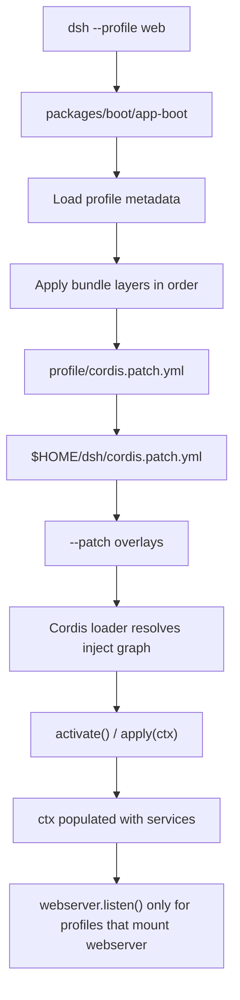
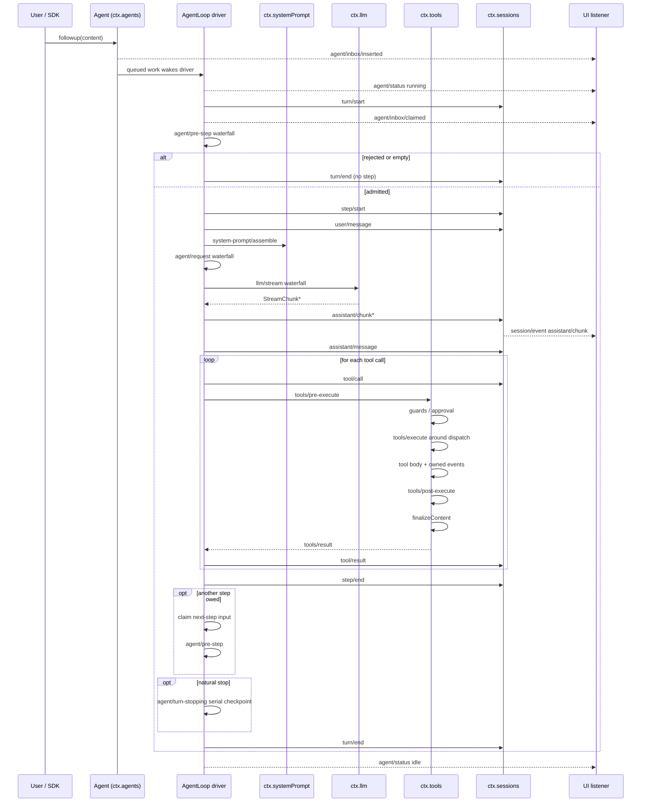
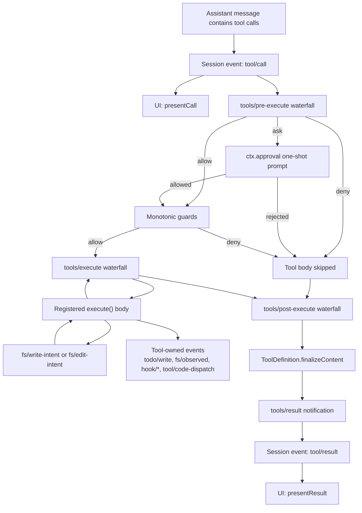
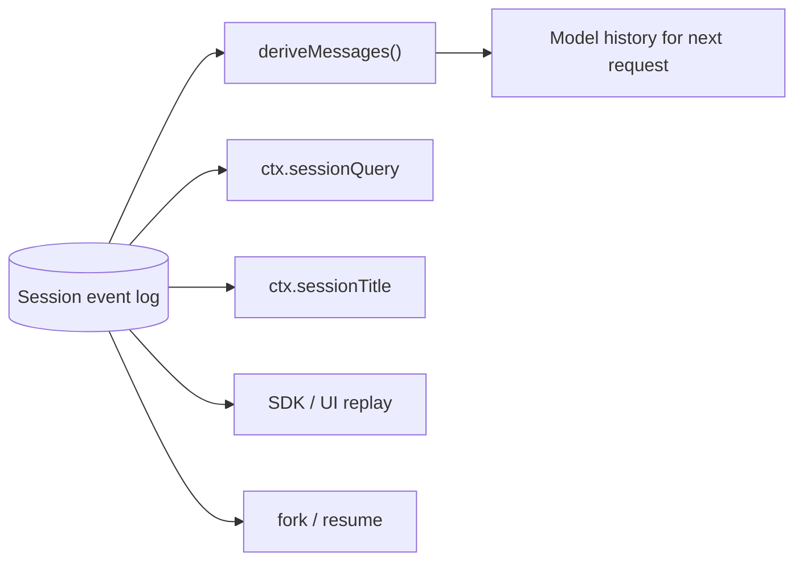
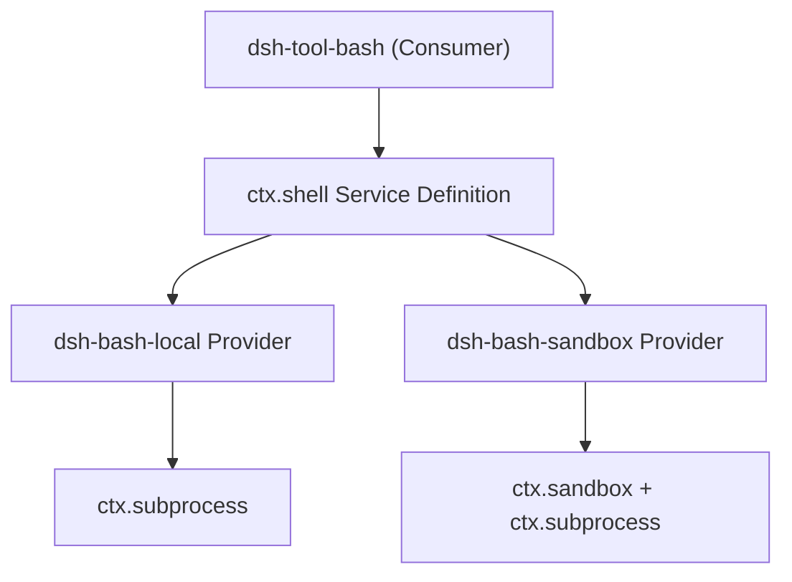
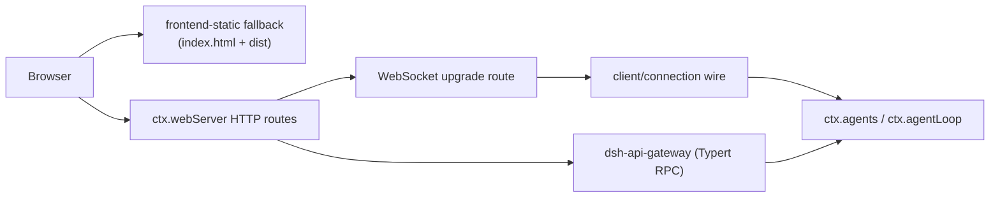
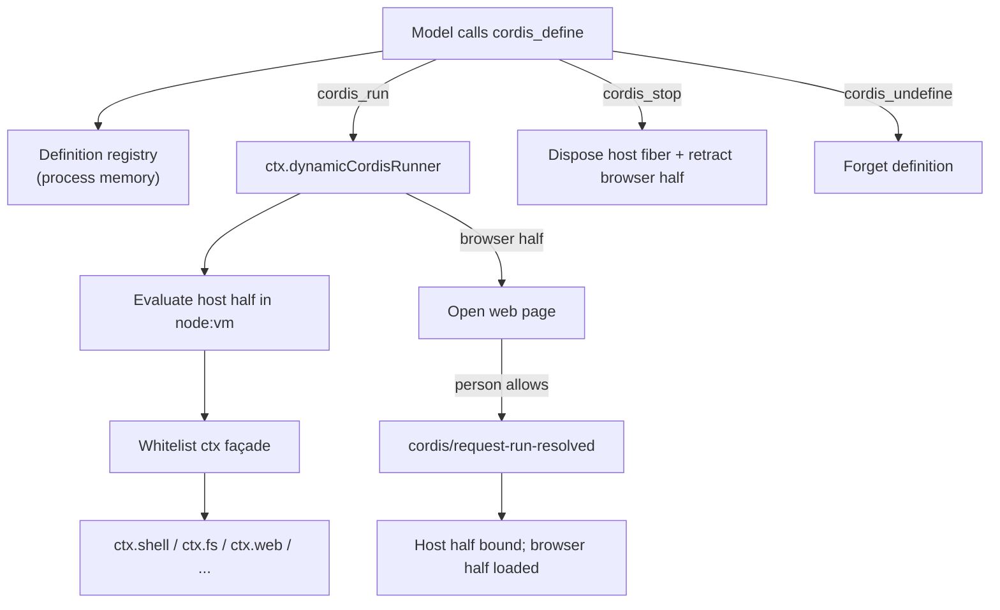

# DeepSeek Harness — Domain Design and Logical Flow

A one-page map of the harness's moving parts for contributors who already know it is a TypeScript/Cordis plugin monorepo.

## 1. Domain map (bounded contexts)

| Domain | Owns | Key `ctx` service | Main packages |
|---|---|---|---|
| **Composition / Boot** | Profile, bundle, patch layers, loader tree, lifecycle | none (Cordis loader) | `packages/boot/app-boot` |
| **Session** | Append-only event log, in-memory projection, fork/resume, titles | `ctx.sessions` | `packages/session`, `packages/session-query` |
| **Agent runtime** | Turn/step driver, inbox, status, prompt assembly | `ctx.agentLoop`, `ctx.agents`, `ctx.systemPrompt` | `packages/core/agent-loop`, `core/agent`, `core/system-prompt`, `core/tools` |
| **LLM capability** | Message vocabulary, streaming adapter seam, providers | `ctx.llm` | `packages/llm/llm` + provider packages |
| **Tools capability** | Tool registry, guarded execution pipeline, tool schemas | `ctx.tools` | `packages/core/tools` |
| **Execution backends** | Bash, PTY, subprocess, sandbox, filesystem, LSP, code runtime | `ctx.shell`, `ctx.terminals`, `ctx.subprocess`, `ctx.sandbox`, `ctx.fs`, `ctx.lsp`, `ctx.codeRuntime` | `packages/shell`, `packages/terminal`, `packages/subprocess`, `packages/sandbox`, `packages/fs`, `packages/lsp`, `packages/code-runtime` |
| **Human collaboration** | Approval, commands, ask-user, feedback, interaction permissions | `ctx.approval`, `ctx.commands`, `ctx.interaction` | `packages/interaction`, `packages/feedback` |
| **Planning and goals** | Same-session goals, plan mode, todo list | `ctx.goals`, `ctx.todo`, `ctx.plan` | `packages/goal`, `packages/plan`, `packages/todo` |
| **Subagent / workflow** | Delegation, Ralph loop, background jobs | `ctx.subagent`, `ctx.workflow`, `ctx.jobs` | `packages/subagent`, `packages/workflow`, `packages/jobs` |
| **Context** | Request context (workspace instructions, time, etc.) | `ctx.context` | `packages/context` |
| **Web host** | HTTP server, route registry, upgrade routes, static fallback | `ctx.webServer` | `packages/host/webserver`, `packages/host/frontend-static` |
| **API / client** | Typert RPC gateway, browser wire, chat UI, conversation nodes | `ctx.apiGateway` (via gateway), client services | `packages/api/*`, `packages/client/*` |
| **Settings / credentials / identity** | User settings, credential records, anonymous identity | `ctx.settings`, `ctx.credentials`, `ctx.identity` | `packages/settings`, `packages/credentials`, `packages/identity` |
| **Self-modification** | Live plugin/service inspection and model-written mount/unmount | `ctx.extensions` | `packages/extensions` |
| **SDK / hooks** | Out-of-process JSON-RPC, Claude Code / Codex wire protocol | `ctx.sdk` | `packages/sdk`, `packages/hooks` |

## 2. Core entities and vocabulary

- **Profile**: a named composition stored in the harness home. It lists bundles and patch files. `web` and `headless` ship as templates.
- **Bundle**: a distribution of Cordis config rows and code that a profile stacks. A bundle can be patched by layers above it.
- **Cordis context**: the runtime container. Plugins expose services on stable `ctx.<key>` keys and communicate through typed events.
- **Capability seam**: a swappable feature with three roles — Service Definition (the `ctx.<key>` and vocabulary), Service Provider (implementation), and Consumer (usually a model-facing tool). One role alone is not a seam.
- **Session**: one conversation stream. The session log is an append-only sequence of `SessionEvent` facts.
- **Turn**: one drain of admitted input. It contains zero or more steps and ends when the model and its tools stop or a policy intervenes.
- **Step**: one model request plus the tool executions it causes.
- **Agent scope**: per-agent registrations (tools, prompt sections, restrictions). Scoped entries shadow same-named global entries for that agent only.
- **Model-visible ⟺ logged**: anything that reaches a model request must be reconstructable from the session log.

## 3. Boot and composition flow

Key points:
- Load order is implied by `inject` declarations, not manual sequencing.
- Every registration is an effect with a disposer; unloading a plugin unwinds its contributions.
- A provider swap (for example, local bash → sandboxed bash) is a composition change, not a code change.

## 4. Agent turn and step lifecycle

Important details:
- `turn/start` and `turn/end` are durable session events.
- `step/start`, `user/message`, `assistant/chunk`, `assistant/message`, `tool/call`, `tool/result`, `step/end` are also durable.
- Live coordination events (`agent/*`, `llm/stream`) are not durable; consume `session/event` for replay.
- `agent/pre-step`, `agent/request`, `llm/stream`, and the `tools/*` events are waterfalls; listeners must call `next()` or they short-circuit the chain.
- `agent/turn-stopping` is a serial terminal checkpoint.

## 5. Tool execution pipeline (zoomed)

Key points:
- `tool/call` is logged before execution so the transcript shows intent even if the call is denied.
- Approval is a first-class capability (`ctx.approval`), not baked into the tool registry.
- Tool-owned events (for example, a todo update) are written by the tool itself during execution.
- `finalizeContent` enforces the tool's synchronous content-only invariant; `tool/result` is the frozen authoritative outcome.

## 6. Session persistence and projection

Invariants:
- The log is append-only and is the source of truth for model-visible state.
- `SESSION_FORMAT_VERSION` only bumps on structural log format changes.
- UI, SDK, and telemetry are projections of the log, not authoritative stores.

## 7. Capability seam swap example

Swapping the provider moves Bash, PTY, and LSP consumers together because filesystem and subprocess providers share one execution world. No consumer code changes.

## 8. Web / API client flow

Notes:
- `dsh-host-webserver` knows no harness concepts; it only provides route registration.
- The API gateway and downlink WebSockets are routes owned by the connection plugin.
- Chat UI nodes are contributed by plugins through `ConversationNodeDefinition` + keyed renderers.

## 9. Extension points map

| What you want to add | Extension point |
|---|---|
| New model provider | Register adapter on `ctx.llm` |
| New model-facing capability | Register tool on `ctx.tools` |
| Per-session capability set | Compose an agent preset with scoped registrations |
| Shell backend | Register `ctx.shell` provider |
| Persistent terminal | Register `ctx.terminals` provider + `dsh-tool-terminal` |
| Human command | Register on `ctx.commands` |
| Background work | Register on `ctx.jobs`; expose `job_*` tools |
| Filesystem policy | Register `ctx.fs` provider or listen to `fs/*` events |
| Process confinement | Register `ctx.sandbox` backend |
| Intercept a tool/turn | Listen to `agent/*` or `tools/*` events |
| Inject model-visible context | Call `agent.inject()`; it lands in the next admitted request |
| New UI chat node | Register `ConversationNodeDefinition` + renderer |
| Durable session state | Extend `SessionEventMap`; render/replay from log |
| Session titles | Register sole `ctx.sessionTitle` provider |
| Same-session objective | Use `ctx.goals` with `agent/*` continuation |
| Fork a session | `ctx.sessions.fork(source, boundary?, childSessionId?)` |
| Scope to one agent | Use that agent's `agent.ctx` |

## 10. Invariants and constraints

1. **Everything is a plugin.** There is no privileged core. Even the agent loop and session log are plugins.
2. **Registrations are effects.** Prompt sections, tools, listeners, and adapters install through `ctx.effect()` / `ctx.on()` and dispose on unload.
3. **Model-visible means logged.** A new model-visible input requires a new `SessionEventMap` entry.
4. **Waterfall listeners delegate.** A listener that does not call `next()` short-circuits the chain.
5. **Scoped shadowing.** Per-agent registrations replace same-named global ones for that agent only.
6. **Capability seams are complete.** A seam needs Service Definition + Provider + Consumer.
7. **Append-only log.** Session events are never mutated after append.
8. **Trust typed boundaries.** Runtime validation is reserved for parser/config, wire, file, worker, and process boundaries, not same-process typed interfaces.

## 11. Self-modification: dynamic Cordis packages

The harness lets the running agent inspect and temporarily extend its own Cordis runtime through the `dsh-tool-cordis` toolset (backed by `ctx.dynamicCordisRunner` in `packages/extensions`). This is an opt-in, development-only capability treated with the same trust as a bash tool: it is not a security boundary and can affect every session in the same process.

### The five model-facing tools

| Tool | What it does |
|---|---|
| `cordis_inspect` | Read-only report over the current process: live services, plugin fibers, registered tools, temporary packages, and generated API/event references. Narrow with `what` and `name`. |
| `cordis_define` | Records a dynamic package (`name`, `purpose`, optional host half `code`, optional browser half `client`) after syntax-checking both halves. Does not run anything. |
| `cordis_run` | Evaluates the host half in a `node:vm` sandbox and, if a browser half exists, asks an open page to load it. Running an already-running package re-delivers the live version. |
| `cordis_stop` | Disposes the host half and retracts the browser half, leaving the definition runnable again. |
| `cordis_undefine` | Stops the package if needed and removes the definition. The card stays in the transcript as a record. |

### Host-only vs dual-half packages

A package can have a **host half** (runs inside the DSH process), a **browser half** (loaded into the web client), or both. Host-only packages affect the runtime immediately. Dual-half packages need a human page to answer the run request because the browser half cannot be forced onto a remote client.

### Sandbox semantics

- Code is evaluated as an async function body in a fresh `node:vm` realm with minimal globals.
- Node built-ins such as `require`, `fetch`, `setTimeout`, and `Buffer` are either absent or redirect to Cordis services, steering mounts onto `ctx.fs`, `ctx.web`, `ctx.bash`, and timer helpers.
- The host half receives a whitelist `ctx` façade that exposes injectable services but hides framework internals; it cannot call `ctx.effect()` directly.
- Service reads require a declared `inject`, preserving Cordis activation and unload semantics.
- `harness.defineTool` / `harness.registerTool` register tools through the host registry so schemas and bodies are normalized and disposable.
- `vmTimeoutMs` bounds only synchronous evaluation; an async body escapes it.

### Composition and lifecycle

- Dynamic packages are mounted under an internal `cordis-dynamic` group fiber.
- Each package gets a process-local id such as `dyn-1`.
- Packages can depend on each other through ordinary Cordis `provide` / `inject`: package A provides `foo`, package B injects `foo` and activates when it exists.
- `cordis_stop` and `cordis_undefine` unwind every owned tool, listener, service, timer, and effect to quiescence.
- Temporary packages disappear on toolset unload or DSH restart.

### API catalog and inspectability

`cordis_inspect` renders from a generated catalog (`src/api-catalog.ts`) that is freshness-gated by `pnpm run verify-cordis-api`. The catalog is produced by the same AST scan as `docs/subsystems/`, so the API the model reads and the published docs cannot drift. Broad reports show summaries; an exact `name` returns full method signatures, JSDoc, and referenced types.

### Storage stance

Definitions live only in process memory. The session log records tool-call metadata, not package source, and nothing is written to disk or restored after restart. To keep an experiment, the model must implement a normal repository plugin or installable bundle through the regular development workflow.

### Trust stance

The sandbox prevents accidental global pollution and guides code toward Cordis services, but a motivated mount can escape through host-realm helpers. A temporary plugin can call `ctx.shell` with the host executor's privileges and reach real filesystems, networks, and other sessions. Load the toolset only where that level of trust is acceptable.